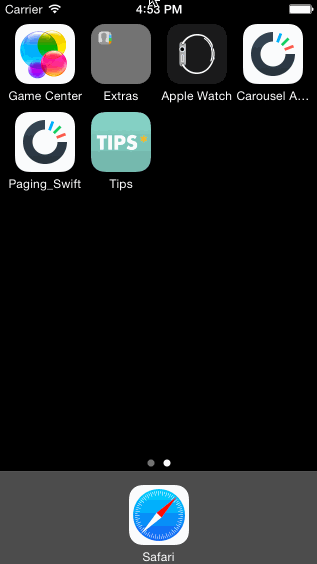

# Carousel App Remake

A remake of Dropbox's Carousel app, an assignment for Codepath's iOS bootcamp.

User stories completed:

- User can scroll through intro
- Wrong username/password causes error
- Blank username/password causes error
- User can swipe through welcome screens
- User can scroll through home feed
- User can view conversation page
- User can view settings
- User can log out

Still getting stuck a lot, did not have time to implement the extra features. I spent a huge chunk of time programmatically making the welcome screens (swiping page views) and then trying to add a button at the end, also in code. But then I found the actual Codepath tutorial that I missed despite looking so I did it using the visual storyboard in the end.

Walkthrough of all user stories:

GIF created with [LiceCap](http://www.cockos.com/licecap/).

## License

2015 Cameron Lock / Codepath